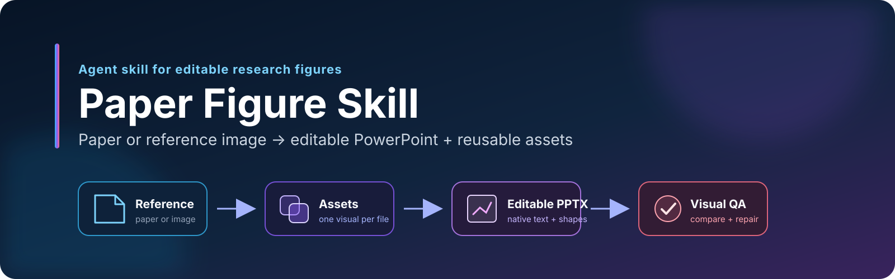
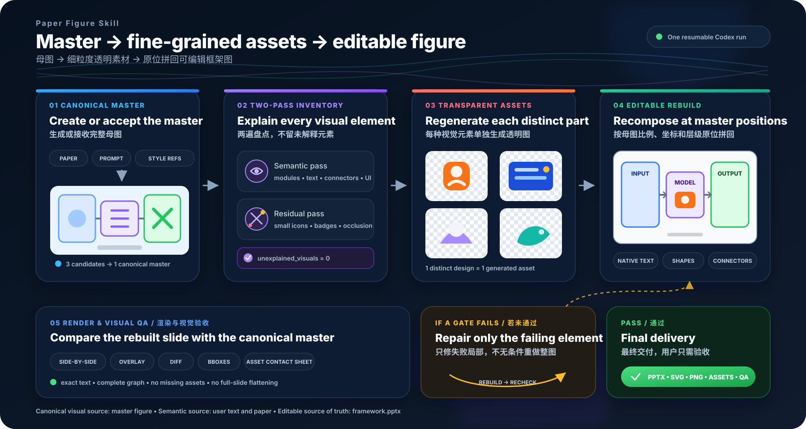

<div align="center">

[English](README.md)



### 从论文或参考图生成真正可编辑的科研框架图。

一个面向 Codex 的 Agent Skill：把研究内容转换为结构化单页 PowerPoint、可复用透明素材和视觉验收结果。

<p>
  <a href="https://github.com/Thanx01/paper-figure-skill/actions/workflows/ci.yml"></a>
  
  
  
  
</p>

**[概览](#概览) · [工作流](#工作流) · [安装](#安装) · [使用](#使用) · [输出](#输出) · [开发](#开发)**

</div>

## 概览

**Paper Figure Skill** 在 Codex 中完成整条科研框架图制作流程：

1. 根据论文建立完整母图，或接收用户提供的参考图；
2. 盘点每个可独立存在的 UI、图标、插画和装饰；
3. 把不同视觉元素重新生成成透明素材；
4. 使用 PowerPoint 原生文字、形状和连线重建版面；
5. 渲染、对比、局部完善并打包交付。

| 输入 | 结果 |
|---|---|
| 论文、方法描述和可选风格参考 | 完整方法图 + 可编辑 PowerPoint |
| 已有框架图或架构图 | 保留结构关系的可编辑重建结果 |
| 中断后的运行目录 | 保留已完成阶段和素材并继续执行 |

## 工作流



| 阶段 | 操作 | 产物 |
|---|---|---|
| **母图** | 接收参考图，或生成并选择结构完整的候选图 | `canonical-master.png` |
| **盘点** | 建立原生对象和细粒度视觉素材映射 | `scene-graph.json`、`assets-manifest.json` |
| **素材** | 同时参考完整图和局部裁剪，生成每一种不同视觉元素 | `assets/png/`、`assets/svg/` |
| **组装** | 按标准化坐标放置原生对象和透明素材 | `framework.pptx` |
| **验收** | 对比渲染结果、检查结构并完善指定区域 | `qa/`、`qa-report.json` |

文字、面板和连线保留为 PowerPoint 原生对象；复杂视觉元素以锁定纵横比的透明素材放置。同一素材的重复实例共享经过检查的素材文件，同时在场景图中保留各自位置。

## 安装

把仓库添加为个人 Codex 插件市场：

```bash
codex plugin marketplace add Thanx01/paper-figure-skill --ref main
```

重启 Codex Desktop，打开 **Plugins（插件）**，选择 **personal（个人）** 市场并安装 **Paper Figure Skill**。

本地开发安装：

```bash
git clone https://github.com/Thanx01/paper-figure-skill.git
codex plugin marketplace add /absolute/path/to/paper-figure-skill
```

## 使用

### 重建参考图

附上原图并发送：

```text
使用 $paper-figure 处理附件中的科研框架图。

识别图中每个可独立存在的 UI、图标、插画和装饰，为每一种不同视觉元素生成透明素材；
随后按参考图的画布比例、位置、层级、连线和配色重建一页可编辑 PowerPoint。
文字、面板和连线保留为原生对象。完成视觉验收并返回完整交付包。
```

### 从论文创建框架图

附上论文和可选风格参考并发送：

```text
使用 $paper-figure，根据附件论文制作一张单页方法框架图。

先锁定准确文字、模块和连接关系，生成完整母图候选并选出结构完整的设计；
再建立细粒度透明素材库，组装成可编辑 PowerPoint，完成视觉验收并返回完整交付包。
```

### 继续中断任务

```text
使用 $paper-figure，继续 /absolute/path/to/run-directory 中的任务。
读取 run-state.json，保留已完成阶段和已验收素材，从下一项继续。
```

## 输出

| 路径 | 内容 |
|---|---|
| `framework.pptx` | 可编辑 PowerPoint 源文件 |
| `framework.svg`、`framework.png` | 完整框架图导出 |
| `assets/png/` | 细粒度透明位图素材 |
| `assets/svg/` | 原生矢量或明确标记的混合 SVG 素材 |
| `assets-manifest.json` | 来源、生成策略、复用关系、透明度和可编辑级别 |
| `qa/`、`qa-report.json` | 并排图、叠加图、差异图、元素边界和素材总览 |
| `paper-figure-skill-delivery.zip` | 完整可移交交付包 |

## 验收

工作流检查：

- 逐字文字和必需结构覆盖；
- 场景实例与可复用素材的完整映射；
- 重新生成素材的透明前景内容；
- PowerPoint 原生文字、面板和连线；
- 画布比例、几何位置、纵横比、层级和配色；
- 并排图、叠加图和差异图中的渲染接近程度。

## 开发

<details>
<summary><strong>仓库结构与确定性检查</strong></summary>

Skill 位于 `plugins/paper-figure-skill/skills/paper-figure`，公开 JSON 契约位于 [`contracts/`](contracts/) 中。

Codex 通过 `forge.mjs` 状态机入口执行任务：

```bash
<bundled-node> plugins/paper-figure-skill/skills/paper-figure/scripts/forge.mjs init \
  --request /absolute/path/to/request.json \
  --run-dir /absolute/path/to/run

<bundled-node> plugins/paper-figure-skill/skills/paper-figure/scripts/forge.mjs next \
  --run-dir /absolute/path/to/run
```

运行确定性检查：

```bash
pnpm install --frozen-lockfile
pnpm test
pnpm run validate
```

</details>

## 许可证

[MIT](LICENSE)
